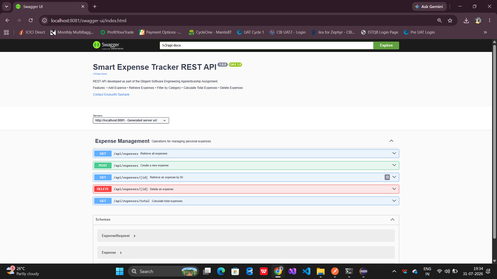
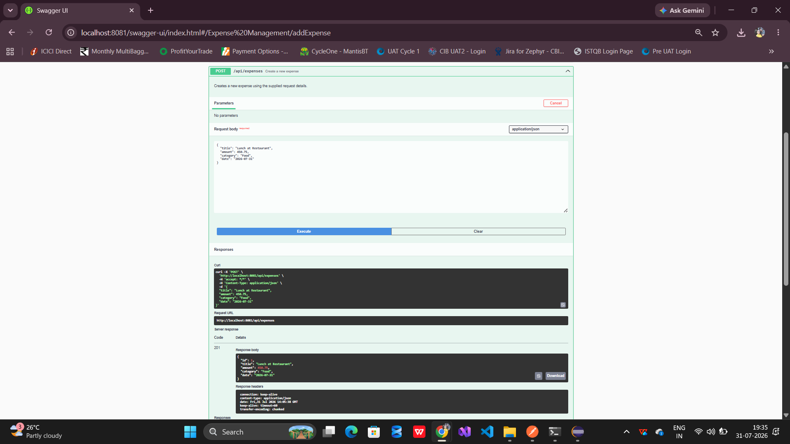
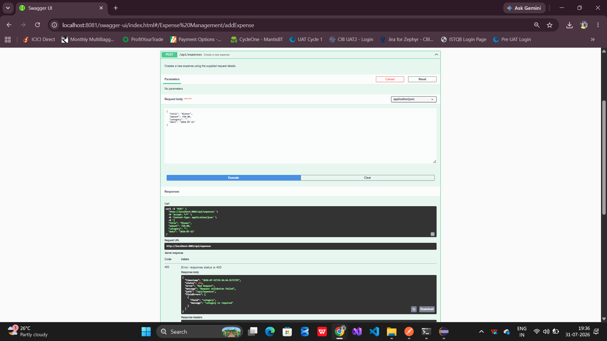

# Smart Expense Tracker REST API

A RESTful Expense Tracking API built using Spring Boot as part of the Diligent Software Engineering Apprenticeship assignment.

The application enables users to create, retrieve, filter, calculate, and delete expenses while demonstrating clean architecture, validation, exception handling, API documentation, and structured logging.

## Overview

Smart Expense Tracker is a Spring Boot REST API that helps users manage personal expenses.

The application supports:

- Creating expenses
- Retrieving all expenses
- Retrieving a single expense
- Filtering expenses by category
- Calculating total expenses
- Calculating category-wise totals
- Deleting expenses

The project follows a layered architecture with proper validation, centralized exception handling, Swagger documentation, and structured logging.

## Features

- Create Expense
- Retrieve All Expenses
- Retrieve Expense by ID
- Filter Expenses by Category
- Calculate Overall Expense Total
- Calculate Category-wise Totals
- Delete Expense
- Bean Validation
- Global Exception Handling
- OpenAPI / Swagger Documentation
- Structured Logging using SLF4J
- Thread-safe In-Memory Storage

## Technology Stack

| Technology | Version |
|------------|---------|
| Java | 17 |
| Spring Boot | 3.3.4 |
| Maven | 3.x |
| Spring Validation | Included |
| SpringDoc OpenAPI | 2.6.0 |
| SLF4J | Included |
| JUnit 5 | Included |

## Project Architecture

```text
                HTTP Request
                      │
                      ▼
            ExpenseController
                      │
                      ▼
             ExpenseService
                      │
                      ▼
      ConcurrentHashMap (In-Memory Store)
                      │
                      ▼
             JSON HTTP Response
```

## Project Structure

This project follows the standard Maven/Spring Boot directory layout.

Test classes are located under:

src/test/java

which is the conventional location used by Maven and executed via:

mvn test

---


## API Endpoints

| Method | Endpoint | Description |
|---------|----------|-------------|
| POST | /api/expenses | Create expense |
| GET | /api/expenses | Retrieve all expenses |
| GET | /api/expenses/{id} | Retrieve expense by ID |
| GET | /api/expenses?category=Food | Filter by category |
| GET | /api/expenses/total | Overall total |
| GET | /api/expenses/total?category=Food | Category total |
| DELETE | /api/expenses/{id} | Delete expense |


### Create Expense

```http
POST /api/expenses
```

```json
{
  "title":"Lunch",
  "amount":250.00,
  "category":"Food",
  "date":"2026-07-31"
}
```


## Validation Rules

| Field | Validation |
|--------|------------|
| title | Required |
| amount | Required, > 0 |
| category | Required |
| date | Required |

## Exception Handling

The API uses centralized exception handling through `GlobalExceptionHandler`.

Possible responses include:

- 400 Bad Request
- 404 Not Found
- 500 Internal Server Error

Each response follows a consistent JSON structure.

## Swagger Documentation

After starting the application, access:

```
http://localhost:8081/swagger-ui/index.html
```

Swagger provides interactive API documentation for all endpoints.

## Logging

The project uses SLF4J for structured logging.

Implemented log levels:

- INFO
- DEBUG
- WARN
- ERROR

Business events such as creating and deleting expenses are logged using INFO, while validation failures and unexpected exceptions are logged using WARN and ERROR.

## How to Run

Clone the repository

```bash
git clone https://github.com/Sashank-09/expense-tracker.git
```

Navigate

```bash
cd expense-tracker
```

Build

```bash
mvn clean install
```

Run

```bash
mvn spring-boot:run
```

## Running Tests

```bash
mvn test
```

## Project Structure

```text
src
├── controller
├── dto
├── exception
├── model
├── service
├── config
└── resources
```


## Design Decisions

- Used ConcurrentHashMap to provide thread-safe in-memory storage.
- Used AtomicLong for thread-safe ID generation.
- Used BigDecimal for monetary values to avoid floating-point precision issues.
- Implemented centralized exception handling using @RestControllerAdvice.
- Used Bean Validation to validate incoming requests.
- Added Swagger/OpenAPI for interactive API documentation.
- Used SLF4J for structured logging.

## Future Enhancements

- Database integration using PostgreSQL
- Spring Data JPA
- User Authentication using Spring Security
- JWT Authorization
- Pagination & Sorting
- Docker support
- Cloud Deployment

## Screenshots

### Swagger UI



### Create Expense



### Validation Error




## AI Usage

AI tools (Claude and ChatGPT) were used to assist with brainstorming, API documentation, and code review. All generated suggestions were manually reviewed, validated, tested, and integrated only after verification. The overall design decisions, implementation, and testing remain the author's responsibility.

## Author

**Enukurthi Sashank**

B.Tech – Artificial Intelligence & Data Science

Spring Boot REST API Project for the Diligent Software Engineering Apprenticeship